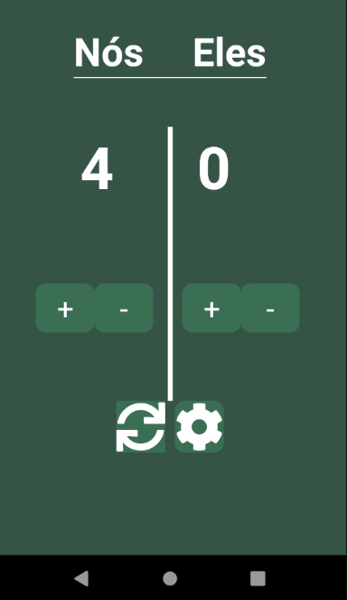
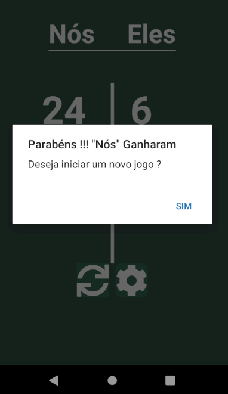

<h1 align="center">
    

</h1>

<h1 align="center">Truco Scoreboard</h1>

Truco Scoreboard consiste em um aplicativo para marcar pontuações do jogo de cartas chamado truco. Sendo possivel também configurar a pontuação necessária para vitoria

  

  

  

   

---

## Sumario

<ul>
  <li><a href="#-ponto-de-partida">Ponto de Partida</a></li>
  <li><a href="#-funcionalidades-do-aplicativo">Funcionaldiades do Aplicativo</a></li>
  <li><a href="#-licença">License</a></li>
  <li><a href="#-other-platforms">Other Platforms</a></li>
</ul>

---

## 🚀 Ponto de Partida

 Para rodar o aplicativo você precisa instalar um ambiente para aplicativos react-native, tendo em sua maquina ja instalado o NPM e o expo-cli que pode ser instalado pelo própio NPM com o seguinte comando "npm install -g expo-cli"
 
 Com ambos instalados, basta instalar as dependencias do projeto com o comando "npm install" na pasta do projeto e executar a aplicação pelo expo utilizando o comando "npm start"

## 📋 Funcionalidades do Aplicativo

- [ ] Marcador de pontos de uma partida de truco gaúderio
- [ ] Configurar pontos necessário para a vitoria

### Tecnologias

- Core
  - [React Native](https://reactnative.dev/) - Framework para construir aplicativos nativos com react
  - [expo](https://expo.io/)  - Uma plataforma e framework para criação de apps React Native
  
- Navegação
  - [React Navigation](https://reactnavigation.org/) - Roteamento e navegação para aplicativos React Native

- Comunicação HTTP
  - [Axios](https://github.com/axios/axios) - Cliente Http baseado em node.js
- Banco de Dados
   - [AsyncStorage](https://github.com/react-native-community/async-storage) - Provém um simples banco de dados local (offline) de chave e valor que permite gravar informações no mesmo.

## 📝 Licença

Este projeto é licenciado por uma licença MIT - veja a licença [LICENSE](https://github.com/Thalesmoraisdealmeida21/TrucoScoreboard/blob/master/LICENCE) para mais detalhes.

---

